# CyberStakes Some Assembly Required Challenge

Walkthrough for the highest-point flag in CyberStakes 2018. This event was extremely well-run and educational. Thanks a ton to the organizers!

## Overview

This challenge was quite involved and required chaining together a few different steps. These were:

* Reversing the main miner <-> C2 communication encryption
* Discovering a SQL injection vulnerabilty in the C2 server
* Recovering the reward-generating JavaScript payload
* Overcoming JavaScript obfuscation and anti-debugging measures
* Bypassing another layer of encryption

## Getting Acquainted

At first glance, the target website appeared to be a static blog without much going on and no pages aside from the index. However, my computer's fan soon became much louder, prompting me to open Chrome's dev tools and look at what was going on. To my surpise, there was quite a bit of activity.

The first interesting thing that happened on page load was the spawning of a [Web Worker](https://developer.mozilla.org/en-US/docs/Web/API/Web_Workers_API/Using_web_workers). For those unfamiliar, a Web Worker is a modern web feature that allows for executing JavaScript in a background (i.e., separate) thread. The [`worker.js`](./worker.js) script being run within this Web Worker context didn't do much besides set a few configuration variables and kick off execution of the `miner.js` script.

The [`miner.js`](./miner.js) script is a beast, but not too complex once you figure out what's going on. It is mainly boilerplate generated by the [Emscripten](https://developer.mozilla.org/en-US/docs/Mozilla/Projects/Emscripten) compiler, which is a powerful tool commonly used to compile C and C++ code into JavaScript to be run in the browser or other JavaScript runtimes like [Node.js](https://nodejs.org/en). However, in this case, it was paired with the equally powerful [`asm.js`](http://asmjs.org/) project to execute a WebAssembly file.

[WebAssembly](https://webassembly.org/) is another modern web feature that is an attempt to bring a computationally-efficient and portable JavaScript alternative to browser runtimes. It is a stack-based opcode language that isn't too tough to grok if you read some of the great resources online, like [here](https://github.com/sunfishcode/wasm-reference-manual).

So what was this WebAssembly payload actually doing to my poor laptop fan? For starters, I noticed that two [IndexedDB](https://developer.mozilla.org/en-US/docs/Web/API/IndexedDB_API) tables were created in my browser's local storage. One was named `blocks` and the other was named `rewards`, as shown below.

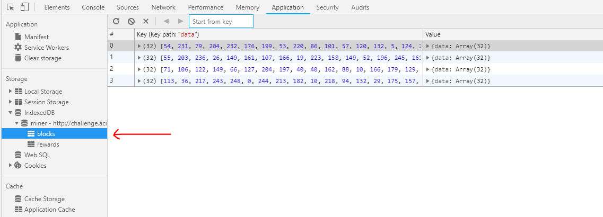

As shown, the `blocks` table was periodically filling up with data. The reference to blocks and rewards (in addition to one of the files being dubbed `miner.js`) gave me a feeling that I was dealing with some type of cryptocurrency miner. My next step was to perform some static analysis on the WebAssembly binary to get a better understanding of the bulk of the payload.

Fortunately, there are some great tools that exist to do such analysis. The one I went with was [WABT - The WebAssembly Binary Toolkit](https://github.com/WebAssembly/wabt). This collection of tools allows you to translate wasm binaries to C source code, which makes some of the analysis much easier.

After some poking around the C source, I felt like I had a better understanding of the important functions and where I should focus the efforts of my dynamic analysis in the Chrome debugger. Here are some of the key routines found in the binary:

* `_main` - the main entrypoint for execution flow
* `_sha256_init` / `_sha256_transform` / `_sha256_init` - core hashing functionality for the block mining
* `_build_key` - a routine called only at the very beginning of program execution
* `_do_crypt1` / `_crypt1` / `_crypt1_ks` - functions related to some type of encryption / decryption (applied to all received *and* sent messages)
* `_unxor_script` - a routine which un-xors some portions of the wasm binary, meaning that there are probably some JavaScript snippets embedded within the binary
* `_parse_command` - essentially a big switch statement that parsed received messages from the C2 server
* `_mine` / `_command_mine` - routines for parsing of mining directives from the C2 server and discovering blocks
* `_ask_for_work` - kick things off to get the first command from the C2 server

There are also three important functions implemented via JavaScript in `miner.js`: `_run_javascript`, `_save_block`, and `_send_packet`. These all do just what their names indicate. I was most intrigued by `_run_javascript`, as this paired with the `run <text>` command checked for in the `_parse_command` routine allows the C2 server to send and execute arbitrary JavaScript on a miner. Interestingly, these exported JavaScript snippets can also be extracted from the wasm binary's data segment, as shown below.

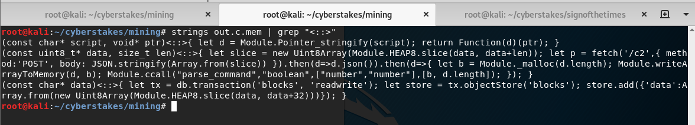

Finally, I also noticed a `_tcrypt` function was exported from the wasm binary (allowing it to be called from JavaScript code) but was never called anywhere within either the wasm binary or the `miner.js` script. I decided to hold off on exploring this for the time being to focus on `crypt1`, but know that it will become an important piece later on.

## Reversing `crypt1`

Knowing that the mining client was both sending and receiving some type of encrypted / obfuscated payload to and from the C2 server, the first obvious step appeared to be reversing this communication stream. This would allow me to communicate directly with the server to both gather more information as well as poke around for vulnerabilities. There appeared to be a few steps involved in this encryption process:

* Load an initial key within the `_build_key` routine
* Further obfuscate this key via the `_crypt1_ks` routine
* Run the actual encryption routine using this obfuscated key, done in the `_crypt1` routine

I was able to determine this chain of events from some analysis of the first message that the miner sends to the C2 server, which, when decrypted, is the plaintext string `hello`. This ended up being something very important to find, as the address in memory of the `hello` string was statically defined to `5620`. This meant that I knew the memory location of a string that would always be encrypted and sent to the C2 server on program startup. If I paused execution, overwrite this address with a string of my choosing, and then resumed execution, I could send any encrypted message I wanted to the C2 server.

While I could have used this mechanism to obviate the need to reverse `crypt1`, each iteration of this manual overwrite process was fairly time-consuming. If I was going to be searching for vulnerabilities in the C2 server, I would need something quick and dirty like a Python script (which would require actually reversing the encryption). However, this overwrite at memory location `5620` will be an important piece later on.

Returning to our pursuit of reversing this encryption, we can see the encrypted `hello` message being sent in the below screenshot from Chrome's networking tools.

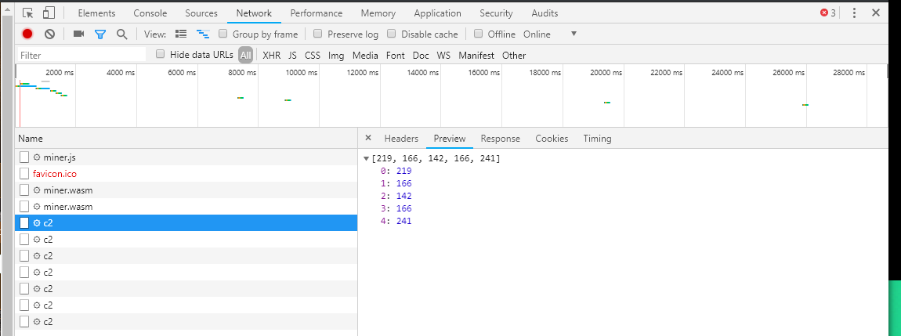

Further examination of the call stack during other chains of events in the program's execution confirmed that `_crypt1` is the driver behind all encryption and decryption of communication with the C2 server. An example of the call stack for the block-mining flow of function calls is shown towards the right of the below screenshot.

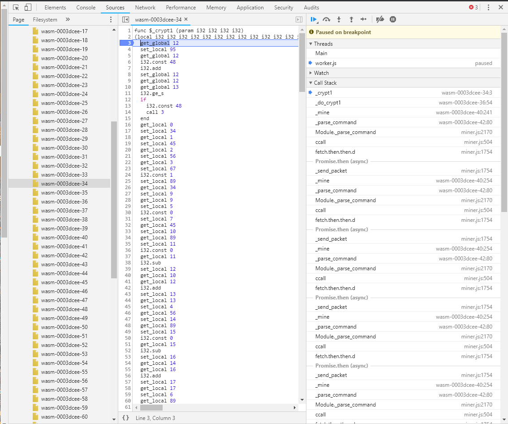

Working backwards from the first `hello` message being sent over the wire, I could now understand how the encryption key was generated. First, two JavaScript snippets are extracted from the wasm binary by un-xoring their contents. These scripts write two pieces of information to memory, which are concatenated to form the "first-level" key. The first snippet pulls the port number from the URL:

```javascript
let pointerize=(s)=>{let b=Module._malloc(s.length+1);Module.writeAsciiToMemory(s,b);return b};return pointerize(location.port);
```

The second snippet uses the `deploy_key` variable defined within `worker.js`:

```javascript
let pointerize=(s)=>{let b=Module._malloc(s.length+1);Module.writeAsciiToMemory(s,b);return b};return pointerize(deploy_key);
```

These snippets could be pulled from memory by setting a breakpoint within the `_run_javascript` function, as shown below.

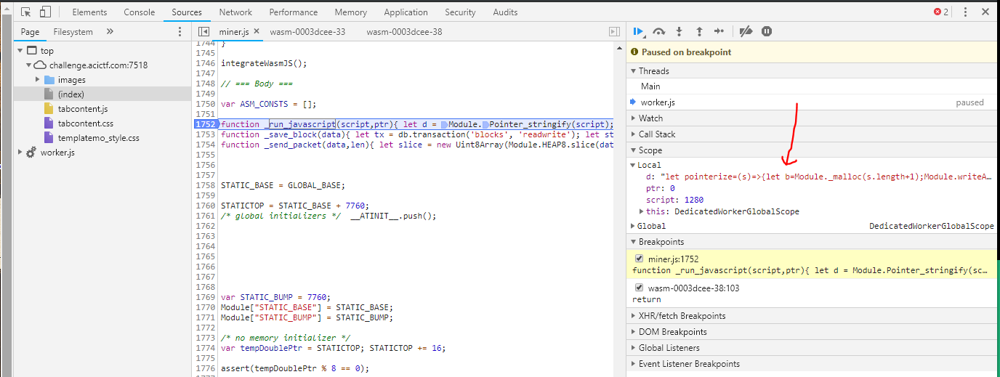

So, our first-level key is `75182d613b486cbb9a01c37498676f325759`. Unfortunately, there is yet another step to be performed before this key can be used to encrypt / decrypt messages. This next step comes in the form of the `_crypt1_ks` routine. While I never bothered to fully understand the internals of this routine, I was able to gather that it essentially extends our first-level key to a length of 256 bytes and leaves it memory to be used by the core `_crypt1` routine later on. In the below screenshot, I've highlighted the indication of the 256-byte length as well as the first argument, which is where the resulting second-level key will be written to in memory.

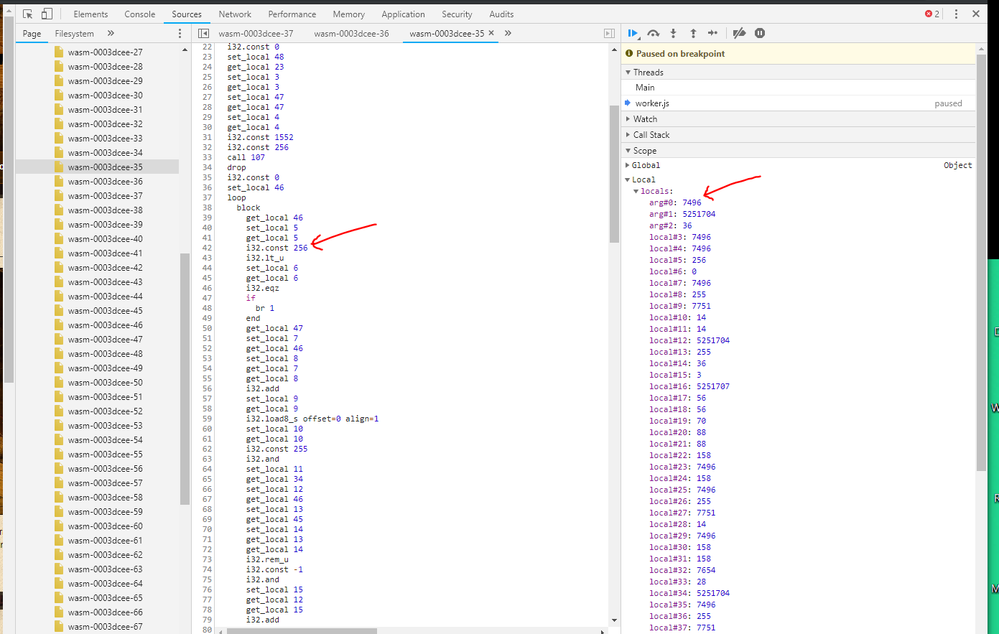

Now with that part figured out, I could determine what arguments are passed to `_crypt1`. Below is an example from stepping through the encryption of `hello`.

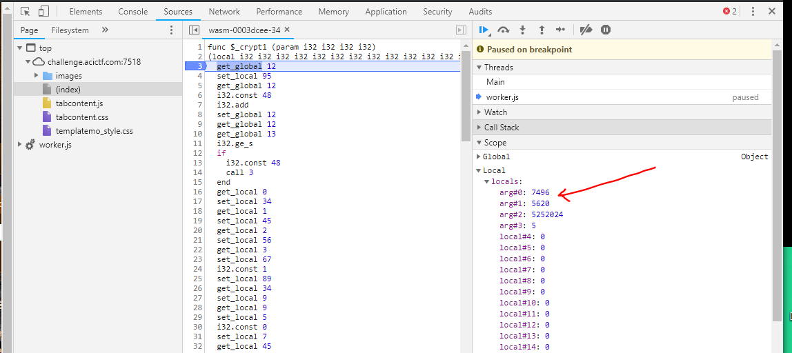

What do each of these arguments mean?

* `arg#0` - the starting location in memory of the 256-byte second-level key
* `arg#1` - the starting location in memory of the plaintext to be encrypted (remember that `hello` is statically defined at memory location `5620`)
* `arg#2` - the starting location in memory of where the resultant encrypted message will be written to
* `arg#3` - the length of the message

Of note is that encrypted and plaintext messages were always the same length, which makes verification a little bit easier. We can confirm that the `crypt1` function is acting on the plaintext `hello` as we expected by inspecting the memory locations in the debugger. I've highlighted `hello` in memory in the below screenshot. 

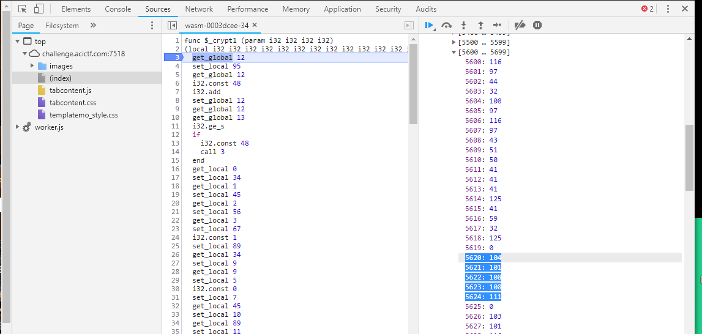

Knowing that `arg#0` points to the starting location of the 256-byte second-level key from memory, I could fairly easily extract it with the Chrome debugger. Because this is based on the static port number and deploy key, it is always the same and could be used in my reversal of the encryption logic. I now had enough information to try my hand at reversing the core `_crypt1` routine. The first step  was to examine its C source (some of which is shown below). 

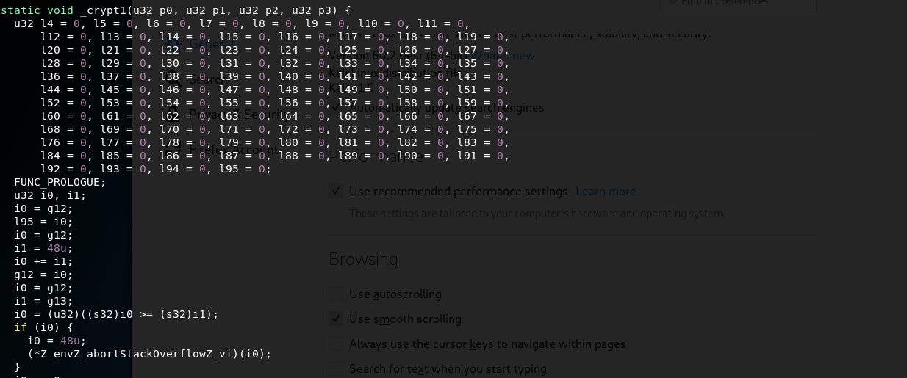

So, all of the parameters and local variables are not helpfully named. This makes sense since WebAssembly is essentially a chain of pushing and popping local variables onto and from the stack. I realized that reversing this by translating its logic by hand was probably beyond my ability to do in a timely fashion, so I turned to alternative methods.

Since I knew that `_crypt1` was a pure function (i.e., its output relies solely on the parameters passed to it and not on any other system state), I could "cheat" a little bit by shimming the WebAssembly linear memory within a Python script and allow the routine (mainly unchanged) to act on that shimmed memory (consequently writing its result to a known location where I could read it).

Using this method, all I had to do was make a few syntactic changes to the disassembled C code and replace the WebAssembly memory loading and storing instructions with reads and writes to my shimmed memory object (which was just a Python list of integers). The resultant reversal of this encryption was a simple command-line Python application, found in the [`crypt1_reversed.py`](./crypt1_reversed.py) file in this repository.

## Talking with the C2 Server

Great. So now that we can talk freely with the C2 server, the flag should be just around the corner (ha!). There are a few commands that a miner can send the C2 server. First, there is the aforementioned `hello`, which simply gets another `hello` response.

The miner can also send its results to the C2 server via a `mine_found <hash> <hash>`-style command. The C2 server will then respond with a directive to mine the next block. Some experimentation showed that pretty much any two random arguments are accepted for this command without changing the style of responses from the server, so this did not appear to be a valid attack vector. Because no session information was tracked between the miner and the C2 server, I could rule out the possibility of having to mine a certain number of blocks to trigger a reward from the server.

The `get_cmd` command, on the other hand, soon attracted my attention. The way this command works is by supplying a deployment key as an argument in order to get a new directive from the C2 server. Here is an example of the intended operation, which tells a miner to start mining.

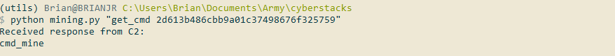

I was able to observe that sending an invalid deployment key generates a `no_command` response (as shown below). This indicates that some type of lookup is being performed. If there's a database behind that lookup, this could be the way in.

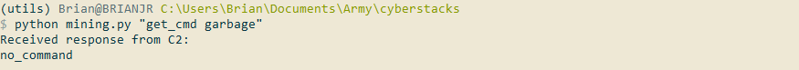

The first indication of this input being injectable came from the sending a single `'` as the `get_cmd` argument. We should expect to get a normal `no_command` response. As shown below, though, we get a big lead instead.

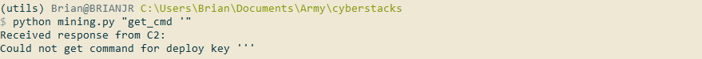

Toying around with this, I was able to build my first proof-of-concept SQL injection exploit for the C2 server. Of note is that *no spaces* are permited in the payload, as demonstrated below.

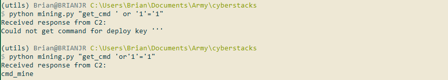

This lack of spaces was only a minor obstacle, though, as I could just substitute `/*_*/`-style comments wherever a space was needed. I extended my initial proof-of-concept to perform a `union select`-style enumeration of keys in the table. The first few responses were `cmd_mine` (indicating that I was indeed reading valid entries in the table), until I hit something interesting:

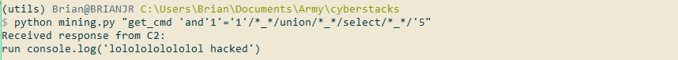

It's nice to see the event organizers have a sense of humor. This command is using the `run <js code>` directive to run the specified code snippet within a miner's runtime. Knowing I was on the right track, I continued my key enumeration until I hit something *very* interesting at key `8`:

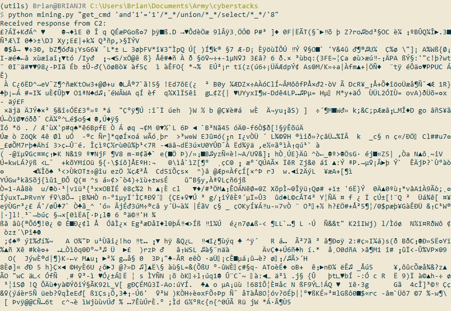

Since this message was big and I knew that I had done a pretty quick job of reversing `crypt1`, I was fairly confident that my decryption was just failing to decode another (but longer) JavaScript snippet. Fortunately, I could use the previously-mentioned string overwrite at address `5620` in wasm memory to send this SQL injection statement and decrypt it within the wasm's reference implementation of `crypt1`. The overwrite of this address with the vulnerable SQL statement (via the Chrome debugger) is shown in the below screenshot. Note that this makes use of Emscripten's `stringToAscii` function.

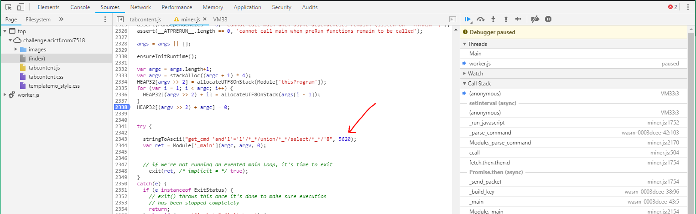

By setting another breakpoint in `_run_javascript`, I could extract the C2-generated decrypted JavaScript snippet from memory, as shown below.

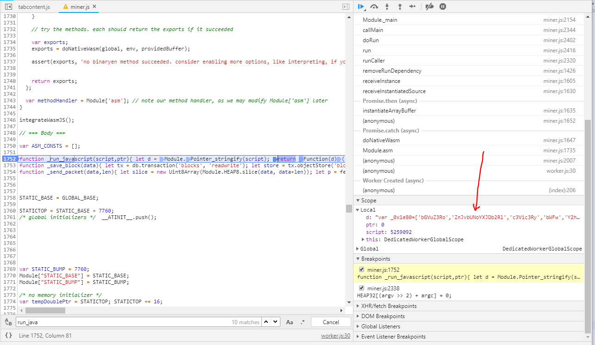

## JavaScript De-obfuscation

I was now in the home stretch, but the JavaScript snippet returned by the C2 was heavily obfuscated. Knowing that nothing had been done yet with the exported `_tcrypt` function (which *was* callable from JavaScript), I figured that this snippet was using it somehow to send back the reward-generating payload to the server. You can take a look at a beautified version of the snippet in the [`reward.js`](./reward.js) file in this repository. Note that that file has been run through [jsnice](http://jsnice.org/). The raw script was:

```javascript
var _0x1e80=['bGVuZ3Ro','ZnJvbUNoYXJDb2Rl','c3Vic3Ry','bWFw','Y2hhckNvZGVBdA==','YXBwbHk=','ZnVuY3Rpb24gKlwoICpcKQ==','XCtcKyAqKD86XzB4KD86W2EtZjAtOV0pezQsNn18KD86XGJ8XGQpW2EtejAtOV17MSw0fSg/OlxifFxkKSk=','aW5pdA==','dGVzdA==','Y2hhaW4=','e30uY29uc3RydWN0b3IoInJldHVybiB0aGlzIikoICk=','Y29uc29sZQ==','ZGVidWc=','aW5mbw==','ZXhjZXB0aW9u','bG9n','d2Fybg==','ZXJyb3I=','dHJhbnNhY3Rpb24=','YmxvY2tz','cmVhZG9ubHk=','Y291bnQ=','b25zdWNjZXNz','cmVzdWx0','cmVhZHdyaXRl','Y2xlYXI=','cmV3YXJkcw==','b2JqZWN0U3RvcmU=','YWRk','cmV3YXJk','d2t2cHo=','c3RyaW5naWZ5','cGFkRW5k','X21hbGxvYw==','d3JpdGVBcnJheVRvTWVtb3J5','d3JpdGVBc2NpaVRvTWVtb3J5','dGNyeXB0','Ym9vbGVhbg==','bnVtYmVy','c2xpY2U=','ZnJvbQ==','anNvbg==','dGhlbg==','Z29vZA==','ZmxhZw==','c3RyaW5n','Y291bnRlcg==','Y29uc3RydWN0b3I=','Y2FsbA==','YWN0aW9u','Z2dlcg==','c3RhdGVPYmplY3Q='];var _0x26be=function(_0x4fb800,_0x3afdae){_0x4fb800=_0x4fb800-0x0;var _0x3fcfe5=_0x1e80[_0x4fb800];if(_0x26be['qLftMO']===undefined){(function(){var _0x1a4300=function(){var _0x43bfe6;try{_0x43bfe6=Function('return\x20(function()\x20'+'{}.constructor(\x22return\x20this\x22)(\x20)'+');')();}catch(_0x196651){_0x43bfe6=window;}return _0x43bfe6;};var _0x6c28bf=_0x1a4300();var _0x433e9f='ABCDEFGHIJKLMNOPQRSTUVWXYZabcdefghijklmnopqrstuvwxyz0123456789+/=';_0x6c28bf['atob']||(_0x6c28bf['atob']=function(_0x14d450){var _0x1a4741=String(_0x14d450)['replace'](/=+$/,'');for(var _0x295370=0x0,_0x1bb497,_0x114b2b,_0x25b0f5=0x0,_0x23f73c='';_0x114b2b=_0x1a4741['charAt'](_0x25b0f5++);~_0x114b2b&&(_0x1bb497=_0x295370%0x4?_0x1bb497*0x40+_0x114b2b:_0x114b2b,_0x295370++%0x4)?_0x23f73c+=String['fromCharCode'](0xff&_0x1bb497>>(-0x2*_0x295370&0x6)):0x0){_0x114b2b=_0x433e9f['indexOf'](_0x114b2b);}return _0x23f73c;});}());_0x26be['yMxSxC']=function(_0xce4540){var _0x447083=atob(_0xce4540);var _0x1d1926=[];for(var _0x3c3a27=0x0,_0x222e84=_0x447083['length'];_0x3c3a27<_0x222e84;_0x3c3a27++){_0x1d1926+='%'+('00'+_0x447083['charCodeAt'](_0x3c3a27)['toString'](0x10))['slice'](-0x2);}return decodeURIComponent(_0x1d1926);};_0x26be['jnfimM']={};_0x26be['qLftMO']=!![];}var _0x27b5d8=_0x26be['jnfimM'][_0x4fb800];if(_0x27b5d8===undefined){_0x3fcfe5=_0x26be['yMxSxC'](_0x3fcfe5);_0x26be['jnfimM'][_0x4fb800]=_0x3fcfe5;}else{_0x3fcfe5=_0x27b5d8;}return _0x3fcfe5;};let _0x3e8c22=function(_0x1582e7){let _0x1b07b0='';for(let _0x30c69c=0x0;_0x30c69c<_0x1582e7[_0x26be('0x0')];_0x30c69c+=0x2){_0x1b07b0+=String[_0x26be('0x1')](parseInt(_0x1582e7[_0x26be('0x2')](_0x30c69c,0x2),0x10));}return _0x1b07b0;};let _0x1756db=function(_0x1e1356,_0x551a21){return Array['from'](_0x1e1356)[_0x26be('0x3')](function(_0xcd9989,_0x57b68b){return _0xcd9989[_0x26be('0x4')](0x0)^_0x551a21['charCodeAt'](_0x57b68b%_0x551a21['length']);});};let _0x433113=function(_0x1ff931){var _0x34093a=function(){var _0x392dad=!![];return function(_0x25917d,_0x1fab2e){var _0x3ea7de=_0x392dad?function(){if(_0x1fab2e){var _0x131f0b=_0x1fab2e[_0x26be('0x5')](_0x25917d,arguments);_0x1fab2e=null;return _0x131f0b;}}:function(){};_0x392dad=![];return _0x3ea7de;};}();(function(){_0x34093a(this,function(){var _0x2f7372=new RegExp(_0x26be('0x6'));var _0x2b3021=new RegExp(_0x26be('0x7'),'i');var _0x1a21ac=_0x3f4022(_0x26be('0x8'));if(!_0x2f7372[_0x26be('0x9')](_0x1a21ac+_0x26be('0xa'))||!_0x2b3021[_0x26be('0x9')](_0x1a21ac+'input')){_0x1a21ac('0');}else{_0x3f4022();}})();}());var _0x17ff77=function(){var _0x144edb=!![];return function(_0x54bd00,_0x5d9c9e){var _0xe48469=_0x144edb?function(){if(_0x5d9c9e){var _0x51b5a9=_0x5d9c9e[_0x26be('0x5')](_0x54bd00,arguments);_0x5d9c9e=null;return _0x51b5a9;}}:function(){};_0x144edb=![];return _0xe48469;};}();var _0x1784c3=_0x17ff77(this,function(){var _0x125b14=function(){};var _0x2a515b=function(){var _0x36c3a3;try{_0x36c3a3=Function('return\x20(function()\x20'+_0x26be('0xb')+');')();}catch(_0x45f866){_0x36c3a3=window;}return _0x36c3a3;};var _0xd6947=_0x2a515b();if(!_0xd6947[_0x26be('0xc')]){_0xd6947[_0x26be('0xc')]=function(_0x125b14){var _0x9818cd={};_0x9818cd['log']=_0x125b14;_0x9818cd['warn']=_0x125b14;_0x9818cd[_0x26be('0xd')]=_0x125b14;_0x9818cd[_0x26be('0xe')]=_0x125b14;_0x9818cd['error']=_0x125b14;_0x9818cd[_0x26be('0xf')]=_0x125b14;_0x9818cd['trace']=_0x125b14;return _0x9818cd;}(_0x125b14);}else{_0xd6947[_0x26be('0xc')][_0x26be('0x10')]=_0x125b14;_0xd6947[_0x26be('0xc')][_0x26be('0x11')]=_0x125b14;_0xd6947[_0x26be('0xc')][_0x26be('0xd')]=_0x125b14;_0xd6947[_0x26be('0xc')][_0x26be('0xe')]=_0x125b14;_0xd6947[_0x26be('0xc')][_0x26be('0x12')]=_0x125b14;_0xd6947[_0x26be('0xc')][_0x26be('0xf')]=_0x125b14;_0xd6947[_0x26be('0xc')]['trace']=_0x125b14;}});_0x1784c3();let _0x3cac42=db[_0x26be('0x13')]([_0x26be('0x14')],_0x26be('0x15'));let _0x22552d=_0x3cac42['objectStore'](_0x26be('0x14'));let _0x4d36e6=_0x22552d[_0x26be('0x16')]();_0x4d36e6[_0x26be('0x17')]=function(){_0x1ff931(_0x4d36e6[_0x26be('0x18')]);};};let _0x443099=function(_0x28eeaa){let _0x4176d7=db[_0x26be('0x13')](['blocks'],_0x26be('0x19'));let _0x5cc2ae=_0x4176d7['objectStore'](_0x26be('0x14'));let _0x3782b8=_0x5cc2ae[_0x26be('0x1a')]();};setInterval(function(){_0x3f4022();},0xfa0);let _0x1e4498=function(_0x210cc9){let _0x56cc9e=db[_0x26be('0x13')](_0x26be('0x1b'),_0x26be('0x19'));let _0xf0202e=_0x56cc9e[_0x26be('0x1c')]('rewards');_0xf0202e[_0x26be('0x1d')]({'flag':_0x1756db(_0x210cc9,_0x26be('0x1e'))});};console[_0x26be('0x10')]('starting');_0x433113(function(_0x33c946){let _0x2074eb=_0x1756db(_0x3e8c22(deploy_key),_0x26be('0x1f'));console[_0x26be('0x10')](_0x2074eb);let _0x4ec09c={'blocks_mined':_0x33c946};let _0x11acc4=JSON[_0x26be('0x20')](_0x4ec09c);_0x11acc4=_0x11acc4[_0x26be('0x21')](_0x11acc4[_0x26be('0x0')]+(0x8-_0x11acc4[_0x26be('0x0')]%0x8),'\x20');console[_0x26be('0x10')](_0x11acc4);let _0x2e2a20=Module[_0x26be('0x22')](_0x11acc4['length']+0x1);let _0xb1426=Module[_0x26be('0x22')](_0x2074eb[_0x26be('0x0')]+0x1);Module[_0x26be('0x23')](_0x2074eb,_0xb1426);Module[_0x26be('0x24')](_0x11acc4,_0x2e2a20);Module['ccall'](_0x26be('0x25'),_0x26be('0x26'),[_0x26be('0x27'),'number',_0x26be('0x27')],[_0xb1426,_0x2e2a20,_0x11acc4[_0x26be('0x0')]]);let _0x59e819=new Uint8Array(Module['HEAP8'][_0x26be('0x28')](_0x2e2a20,_0x2e2a20+_0x11acc4[_0x26be('0x0')]));let _0x32e2fa=fetch('/c2/reward',{'method':'POST','body':JSON['stringify'](Array[_0x26be('0x29')](_0x59e819))})['then'](_0x29d944=>_0x29d944[_0x26be('0x2a')]())[_0x26be('0x2b')](_0x5a0663=>{if(_0x5a0663[_0x26be('0x2c')]){_0x1e4498(_0x5a0663[_0x26be('0x2d')]);_0x443099();}});});function _0x3f4022(_0x7f1a7b){function _0x4e7aee(_0x3d503a){if(typeof _0x3d503a===_0x26be('0x2e')){return function(_0xfa1d8d){}['constructor']('while\x20(true)\x20{}')[_0x26be('0x5')](_0x26be('0x2f'));}else{if((''+_0x3d503a/_0x3d503a)['length']!==0x1||_0x3d503a%0x14===0x0){(function(){return!![];}[_0x26be('0x30')]('debu'+'gger')[_0x26be('0x31')](_0x26be('0x32')));}else{(function(){return![];}[_0x26be('0x30')]('debu'+_0x26be('0x33'))[_0x26be('0x5')](_0x26be('0x34')));}}_0x4e7aee(++_0x3d503a);}try{if(_0x7f1a7b){return _0x4e7aee;}else{_0x4e7aee(0x0);}}catch(_0x1ad9e0){}}
```

I first tried debugging this script, but in addition to the obfuscation measures taken, there were also some anti-debugging measures in place. Namely, there was an infinite loop `eval`-ing the `debugger` statement. This basically makes it impossible to step through the code with the debugger, as each time Chrome encounters one of these `debugger` statements, it pauses execution. You can read more about this technique and other JavaScript anti-debugging measures at [this great resource](https://x-c3ll.github.io/posts/javascript-antidebugging). The two lines that were the culprits behind these headaches are indicated below.

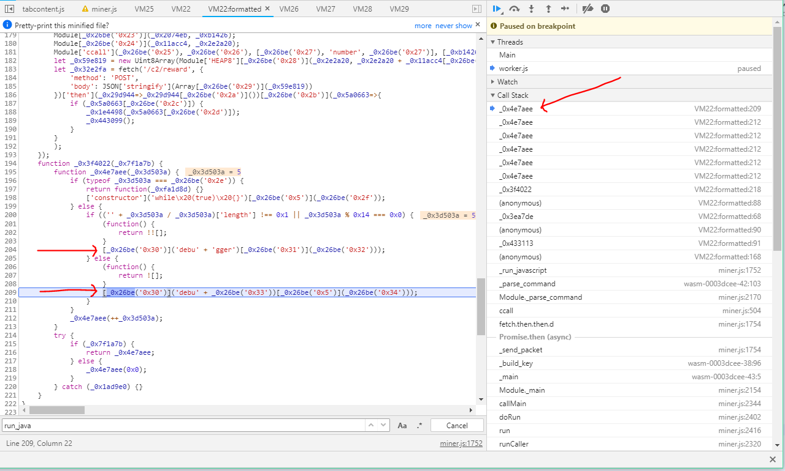

Fortunately (thanks to [this Stackoverflow answer](https://stackoverflow.com/questions/45767855/how-to-totally-ignore-debugger-statement-in-chrome)), I was able to use `Ctrl-F8` to disable all breakpoints (including `debugger` statements). While this meant that I could still not step through the payload script, it did mean that before entering this script's execution, I could doctor some inputs in the debugger. Maybe, if I could inject the right arguments, I could completely bypass having to deal with `tcrypt` and any reversal of this obfuscated script.

Allowing the script to complete its execution yielded an interesting network response, shown below.

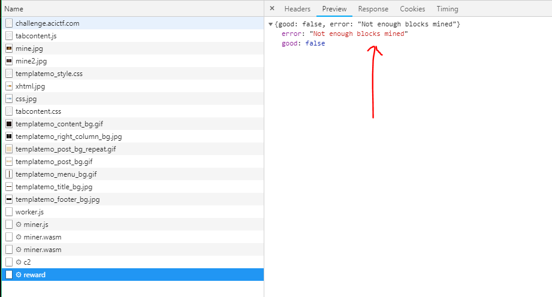

So, it looks like we need to communicate the number of blocks we have mined to the `/c2/reward` path. I had a feeling that mining "enough" blocks would lead to a response from the C2 server that would populate our `rewards` IndexedDB table. Returning to examination of the JavaScript payload, it becomes fairly obvious where the number of blocks mined is indicated, as well as where the network request to `/c2/reward` is made. Both of these locations are shown in the below screenshot.

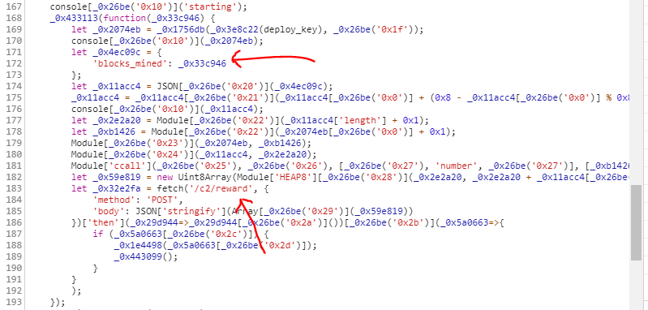

Could it really be as simple as specifying a big number for the number of blocks mined? Let's find out. By again pausing execution in `_run_javascript`, we can edit the snippet that gets run to inject a big number for the `blocks_mined` field. This modified snippet in memory is shown below.

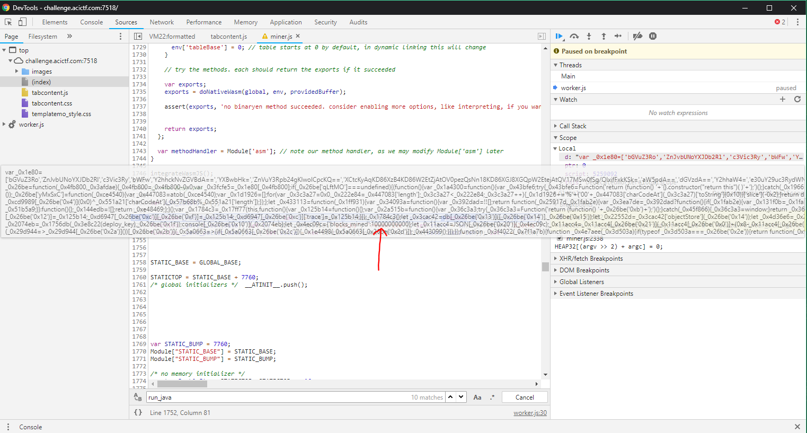

## Rewards

After changing the payload JavaScript snippet in memory, I got a different (and more promising) response from the C2 server, shown below.

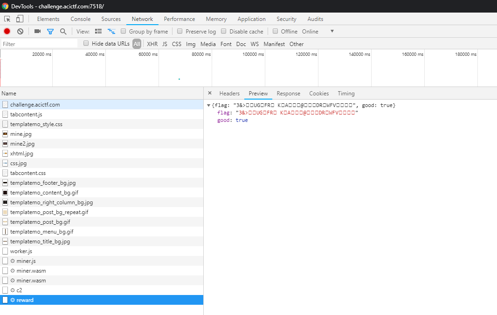

Anxiously checking the `rewards` IndexedDB table, I saw there was a new entry:

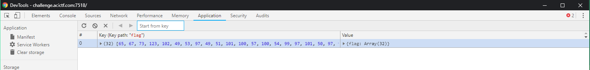

This is simply the ASCII flag: `ACI{f15a13ed9d6cae2acc66a217ccc}`. Too easy.

Thanks for reading!
